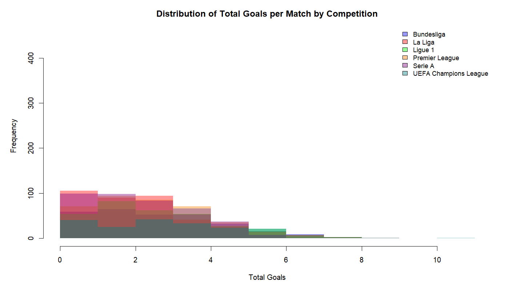

```{r setup, include=FALSE}
knitr::opts_chunk$set(echo = FALSE, warning = FALSE, message = FALSE)
```

## League KPI Table

Generated by `code/make_table.R` from `data/football_matches_2024_2025.csv` using
**competition_name**, **fulltime_home**, **fulltime_away**, **match_outcome**, and **total_goals**.

```{r}
tbl <- read.csv("../tables/league_kpis.csv", stringsAsFactors = FALSE)
knitr::kable(tbl, caption = "League Summary KPIs")
```

## Distribution of Total Goals per Match

Generated by `code/make_figure.R` using **total_goals** by **competition_name**.

```{r, echo=FALSE, out.width="85%"}

```